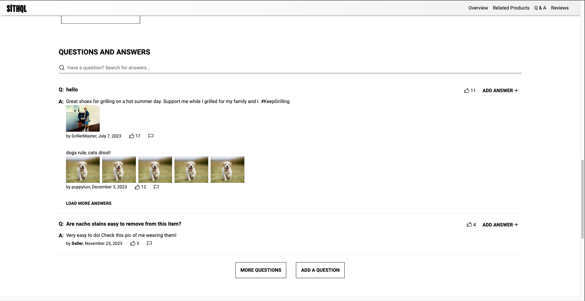
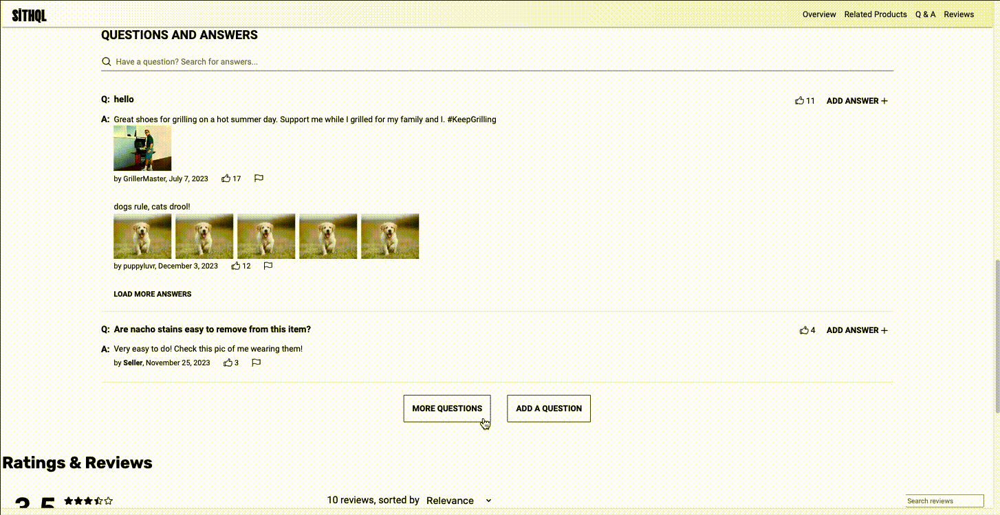

# Sithql

## Tech Stack


## Table of Contents

- [Project Overview](#project-overview)
- [Installation & Setup](#installation--setup)
- [Components](#components)
- [Contributors](#contributors)

## Project Overview

Modern & Interactive front-end e-commerce web application (mobile-friendly) utilizing React and Express that enables users to browse through a collection of over 15 million products, add them to their outfits, read through a robust Q&A section, peruse the products ratings and reviews, and add products to their cart

## Installation & Setup

### Step 1

```
$ npm install -g npm@latest
$ git clone https://github.com/hazelkimberly/Sithql.git
$ npm intall
$ npm run build
$ npm run start
```

### Step 2

- Create a .env file and paste the following:

```
API_URL="https://app-hrsei-api.herokuapp.com/api/fec2/hr-rfp"
GIT_TOKEN="your github token here"
```

### Step 3

- Open http://localhost:3000

---

# Components

- [Product Overview & Details](#product-overview--details)
- [Related Products & Outfits](#related-products--outfits)
- [Questions & Answers](#questions--answers)
- [Ratings & Reviews](#ratings--reviews)

## Product Overview & Details


## Related Products & Outfits


## Questions & Answers



<details open><summary><b>View Questions & Answers</b></summary>

<br/>

> Users can search for a specific question and/or explore all the inquiries and inputs on a specific product

> 

</details>

## Ratings & Reviews

---

# Contributors

### Nathaniel Wise

[Product Overview & Details](#product-overview--details)

[](https://www.linkedin.com/in/nathaniel-wise-911048283/)
[](https://github.com/Gralayer)

### Jose Felix

[Related Products & Outfits](#related-products--outfits)

[](https://www.linkedin.com/in/jose-m-felix/)
[](https://github.com/jose-m-f)

### Hazel Kimberly Carcido

[Questions & Answers](#questions--answers)

[](https://www.linkedin.com/in/hazelkimberly/)
[](https://github.com/hazelkimberly)

### Steven Kim

[Ratings & Reviews](#ratings--reviews)

[](https://www.linkedin.com/in/stevkim/)
[](https://github.com/stevkim)
